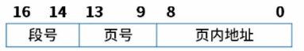
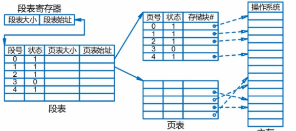
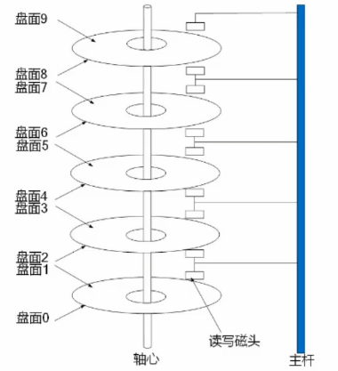

## 存储管理

### 段式存储

按用户作业中的自然段来划分逻辑区间，然后调入内存，段的长度可以不一样

知识点：合法段地址，非法段地址

优点：多道程序共享内存，各段程序修改互不影响

缺点：内存利用率低，内存碎片浪费大

### 段页式存储

段式与页式的综合体，先分段，再分页，1个程序中可以有若干段，每个段若个页面；每个页大小相同，但是每个段不一定相同



如上图所示：

页内地址大小：2^9 = 512字节

每个段最多页数：2^5 = 32页

程序最多段数：2^3 = 8段



优点：空间浪费小，存储共享容易，存储保护容易，能动态链接

缺点：管理软件增加导致复杂性和开销增加，需要的硬件以及占用的内存增加，执行速度大大下降

## 磁盘管理

磁盘知识点：磁道和扇区

基本结构如下：



读取磁盘数据时间 = 寻道时间 + 旋转延迟 + 传输时间

## 文件系统

索引文件结构

默认13个节点，前10个节点直接指向物理地址，属于直接索引，节点指向的物理块存放了数据

第11个索引为一级间接索引，存放了一个索引表，指向物理块

第12个索引为二级间接索引，只想一个索引表，这个索引表指向另一个索引表，再指向物理块

第13个索引为三级简介索引

考察逻辑页号对应的索引方式

## 练习题

假设系统采用段式存储管理，进程P的段表如下，逻辑地址（）不能转换成对应的物理地址，不能转换成物理地址的原因是进行（）

```
A （0，790）和（2，88）
B （1，30）和（3，290）
C （2，88）和（4，98）
D （0，810）和（4，120）

A 除法运算时除数为0
B 算术运算时有溢出
C 逻辑地址到物理地址转换时地址越界
D 物理地址到逻辑地址转换时地址越界
```

| 段号 | 基地址 | 段长 |
| ---- | ------ | ---- |
| 0    | 1100   | 800  |
| 1    | 3310   | 50   |
| 2    | 5000   | 200  |
| 3    | 4100   | 580  |
| 4    | 2000   | 100  |

解析：

如图可知，0号段段长不能超过800，4号段段长不能超过100；

原因是因为逻辑地址到物理地址之间的转换越界；

以下关于计算机内存管理的描述中，（）属于段页式内存管理的描述

```
A 一个程序就是一个段，使用基址极限进行管理
B 一个程序分为许多固定大小的页面，使用页表进行管理
C 程序按照逻辑分为多段，每一段又进行分页，使用段页表来进行管理
D 程序按逻辑分为多段，用一组基址极限进行管理，基址极限对存放在段表里
```

解析：

A 为段式存储的管理方法，B选项为页式存储的管理方法，C选项为段页式存储的管理方法

某磁盘磁头从一个磁道移至另一个磁道需要10ms，文件在磁盘上非连续存放，逻辑上相邻数据块的移动距离为10个磁道，每块的旋转延迟时间及传输时间分别为100ms和2ms,则读取一个100快的数据需要多少时间

解析：

寻道时间 = 10ms * 10道 = 100ms，延迟 + 传输时间 = 100 + 2 = 102ms，一共100块，所需时间为 202 * 100 = 20200ms

假设某个磁盘的每个磁道划分为11个物理块，每块存放1个逻辑记录，逻辑记录R0,R1...R10存放在同一磁道上，记录的存放顺序如下表所示：

| 物理块   | 1  | 2  | 3  | 4  | 5  | 6  | 7  | 8  | 9  | 10 | 11  |
| -------- | -- | -- | -- | -- | -- | -- | -- | -- | -- | -- | --- |
| 逻辑记录 | R0 | R1 | R2 | R3 | R4 | R5 | R6 | R7 | R8 | R9 | R10 |

如果磁盘的旋转周期为33ms,磁头当前处在R0的位置开始，若系统使用单缓冲区顺序处理这些记录，每个记录处理时间为3ms，则处理这11个记录的最长时间是多少？若对信息存储进行优化分布后，处理11个记录的最少时间为多少？

解析：

单缓冲区，同一时刻只能一个用人，起始位置为R0，因此R0消耗时间为: 处理时间 + 读取时间 = 3ms + 33ms / 11 = 6ms

处理完R0之后，顺序处理R1，6ms指针处于R2的位置，如果想继续读取R1，需要再转一圈，需要转过10个物理块，消耗30ms

因此，处理R1-R10，需要时间为 (30ms + 3ms + 3ms) * 10 = 360，加上R0的消耗时间一共为 366ms

对信息进行优化分布，即读取完成R0之后，6ms刚好在R1的位置，节约了旋转时间，需要时间为 6 * 11 = 66ms

假设磁盘臂位于20号柱面上，进程的请求序列如下表所示，如果采用最短移臂调度算法，那么系统的响应序列为？

| 请求序列 | 柱面号 | 磁头号 | 扇区号 |
| -------- | ------ | ------ | ------ |
| 1        | 18     | 8      | 6      |
| 2        | 16     | 6      | 3      |
| 3        | 16     | 9      | 6      |
| 4        | 21     | 10     | 5      |
| 5        | 18     | 8      | 4      |
| 6        | 21     | 3      | 10     |
| 7        | 18     | 7      | 6      |
| 8        | 16     | 10     | 4      |
| 9        | 22     | 10     | 8      |

解析：

一共有4个柱面，分别为18号：1，5，7 ；16号：2，3，8；21号：4，6；22号：9，磁盘臂处于20，因此最先访问21号，再访问22号，在访问18号，最后访问16号

顺序为4，6，9，1，5，7，2，8，3

最后的位置，2，8，3还是2，3，8，根据扇区来判断

某文件系统文件存储采用文件索引节点法，假设次磁盘索引块和磁盘数据块大小均为1kb，每个文件的索引节点中有8个地址项，每个地址项大小为4字节，其中0-5为直接索引地址，6为一级间接索引地址，7为二级间接索引地址，如果访问某个文件需的逻辑号分别为0，260和518，则系统应采用（ ）方式？该文件系统可表示的单个文件最大长度为（ ）？

解析：

数据块索引块大小为1kb，每个地址项4字节，因此，间接索引可以对应 1kb/4b = 256个地址块

0-5为直接索引，6-261为一级间接缩影，262-65797为二级间接索引，能够存储最大的单个文件长度为65798

某字长为32位的计算机文件管理系统采用位示图记录几盘的使用情况，若日磁盘的容量为300GB，物理块大小为1MB，那么位示图的大小为多少字？某页面放在1023号物理块，如何操作？

解析：

容量为300GB，每个字对应32位，一个物理块大小为1MB，因此位示图大小为 300 * 1024 / 32 = 9600个字

| 0   | ... | 31 |
| --- | --- | -- |
| ... | 1   | 0  |
| N   | 0   | 1  |
